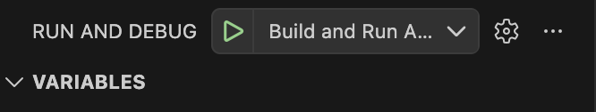
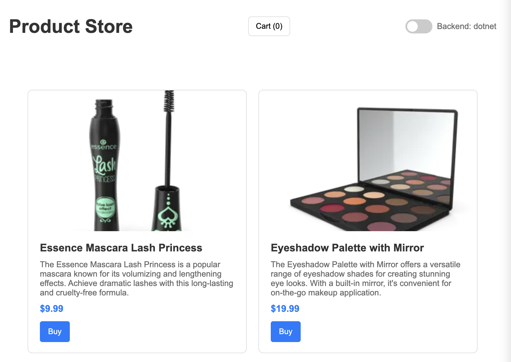
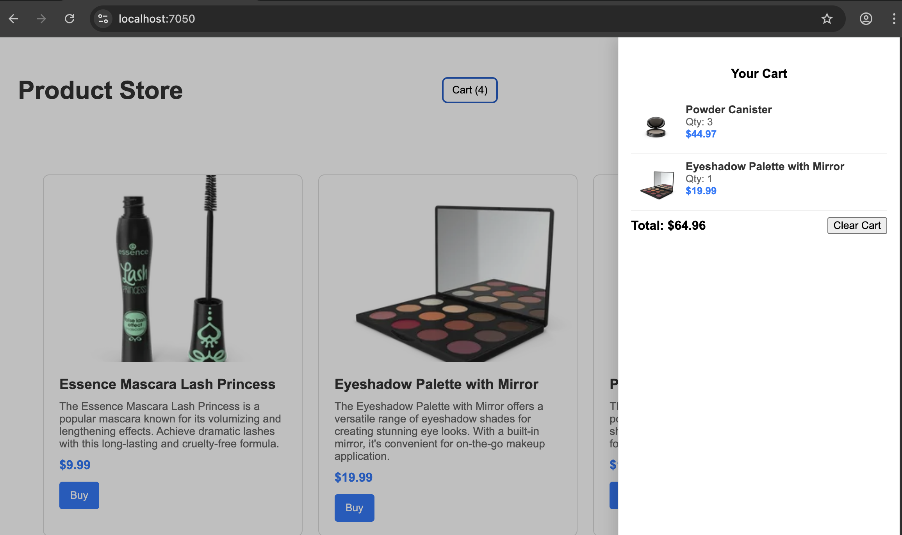

# NBC Product Store

## Directory structure

- Angular client app: nbc-product-store/ClientApp
- Java app: java-product-store
- .NET app: nbc-product-store

---

To run this project in VS Code,

1. Open the Run and Debug view
2. From the configuration dropdown select `Build and Run App`.



3. Click the green arrow to start. This launch configuration will launch both angular, Java and .NET backend

## Command Line

.NET Backend

```bash
cd nbc-product-store/nbc-product-store
dotnet build
dotnet run nbc-product-store.csproj
```

Java backend

```bash
cd nbc-product-store/java-nbc-product
mvn clean install
mvn spring-boot:run
```


Angular Frontend

```bash
cd nbc-product-store/ClientApp
npm install 
ng serve --configuration development
```


Once Angular and .NET backends are running, navigate to https://localhost:7050.

## API Base Url

API base URL is in environment file: `ClientApp/src/app/environment.ts`.

Edit file to point apiUrl to a url (configured to be https://localhost:7050 in this project):

```ts
export const environment = {
	production: false,
	apiUrl: 'https://localhost:7050'
};
```

---

##  Overview

This project currently uses .NET for the server and an Angular single page app for the frontend client.

- **Controllers:** HTTP endpoints are implemented in `Controllers` (ProductsController.cs and CartController.cs). Controllers return JSON API responses to the Angular frontend.
- **Services:** Service classes and helpers are implemented in `Services`. As a singleton, the CartService class can persist cart items in-memory.
- **Middleware:**  `AuthorizationMiddleware` is used to check Authroization header
- **Angular:** The `ClientApp` folder contains the Angular app that the user interacts with and makes backend API calls as needed

User Flow:

1. User lands on product page 
2. User can drag item carousel or use pagination to navigate through items
3. Selecting Buy on an item adds the item to the cart
4. Selecting the Cart button opens the Cart Flyout displaying all items added to cart
5. User can clear cart by selecting Clear button

Logic Flow:

1. Client sends an HTTP request to a controller API.
2. The Middleware pipeline checks Authorization
3. A Controller receives the request, uses Services to handle logic and data, then returns JSON.

---

## State Management

For state management, this app uses Angular Signals with Observables being used for the http api calls to the backend. 

A 3rd party state management library seemed too excessive for a small app.

## Considerations

A tradeoff I had to make was less portable classes and methods in the Java project given the time constraints. The .NET is more akin to production code as its architecture is similar to existing apps I had previously worked on

Given more time I would have focused on the following:
- Single item removal from cart
- A more consistent logging framework for both backends
- Unit Test implementation
- Animations
- Negative test scenario handling

---

## Screencaps

**Product Item Page**



**Cart Flyout**


